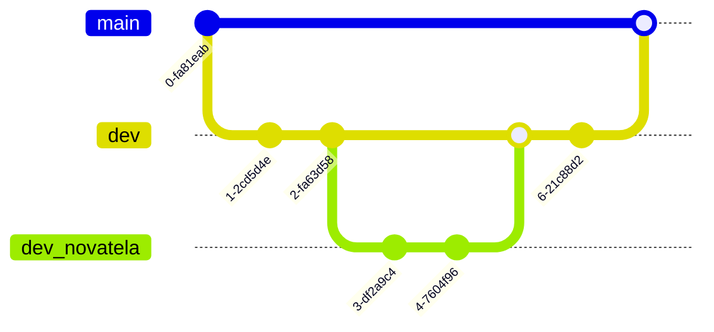
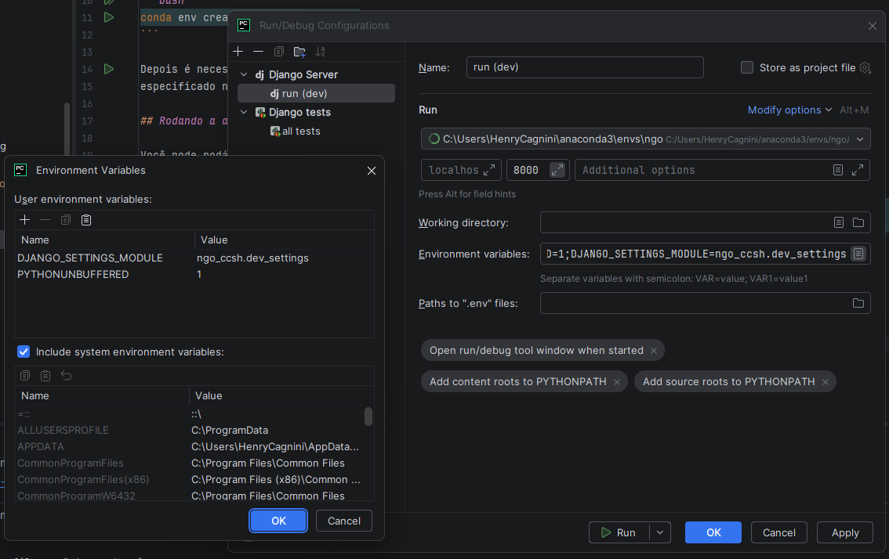

# Desenvolvimento

Esse capítulo explica como configurar o ambiente de desenvolvimento para a aplicação, e como rodar os testes.

## Sumário

* [Onde fazer commits](#onde-fazer-commits)
* [Sem Docker](#sem-docker)
* [Com Docker](#com-docker)

## Onde fazer commits

Existem duas branches principais: `main` e `dev`.

Na `main` deve ser mantido **apenas** o código de produção, pronto para ser usado. Já na `dev` deve ser mantido o código
de desenvolvimento, que contém código (a princípio) estável mas que ainda não está totalmente testado.

Quando desenvolver um novo recurso, crie uma branch a partir da branch `dev`. Prefixe ela com `dev_*`, onde `*` deve ser
o nome do novo recurso sendo implementado. Commite para `dev` apenas quando tiver terminado de implementar o novo 
recurso:



## Sem Docker

### Configuração do ambiente

Para desenvolvimento, recomenda-se utilizar o gerenciador de pacotes [conda](https://docs.conda.io/en/latest/), 
e criar um ambiente virtual para a aplicação:

```bash
conda env create -f environment.yml
```

Depois é necessário ativar o ambiente de trabalho com `conda activate ngo` (sendo `ngo` o nome do ambiente criado, 
especificado no arquivo `environment.yml`).

### Rodando a aplicação em ambiente de desenvolvimento

Crie o banco de dados com

```bash
conda activate ngo
python backend/manage.py create_dev_database --settings=ngo_ccsh.dev_settings
python backend/manage.py seed_dev_database --settings=ngo_ccsh.dev_settings
python backend/manage.py makemigrations --settings=ngo_ccsh.dev_settings
python backend/manage.py migrate --settings=ngo_ccsh.dev_settings
python backend/manage.py createsuperuser --settings=ngo_ccsh.dev_settings
```

Rode a aplicação com 

```bash
python backend/manage.py runserver --settings=ngo_ccsh.dev_settings
```

Ou então criar uma configuração no PyCharm, adicionando a variável de ambiente `DJANGO_SETTINGS_MODULE` com o valor 
`ngo_ccsh.dev_settings`:

[](imagens/configuração_desenvolvimento.png)

Teste a aplicação entrando na URL [http://localhost:8000/admin/](http://localhost:8000/admin/) e usando o usuário criado com o comando 
`createsuperuser`.

## Com Docker

Para executar um container em modo de desenvolvimento localmente, rode os seguintes comandos:
   
```bash
docker compose -f docker-compose.dev.yml build
docker compose -f docker-compose.dev.yml up -d
```

Isso executará o backend e exporá na porta `8001`: [http://localhost:8001/](http://localhost:8001/)

Depois, com o container rodando, crie o super usuário:

```bash
docker compose -f docker-compose.dev.yml exec web python manage.py createsuperuser
```

## Variáveis de ambiente

Crie um arquivo `.env` na raiz do projeto, e adicione as seguintes variáveis de ambiente:

```python
DEBUG=True
APP_FULL_NAME="Sistema de Gerenciamento de Gastos Acadêmicos da UFSM"
APP_SHORT_NAME="SIGGA"
FRONTEND_URL="http://localhost:5173"
EMAIL_HOST_USER="henry.cagnini@ufsm.br"
EMAIL_HOST_PASSWORD="aaaa bbbb cccc dddd"
DEFAULT_FROM_EMAIL="Núcleo de Gestão Orçamentária <henry.cagnini@ufsm.br>"
DJANGO_SECRET_KEY="alguma_string_com_pelo_menos_32_caracteres"
JWT_SIGNING_KEY="alguma_OUTRA_string_com_pelo_menos_32_caracteres"
```

O `EMAIL_HOST_PASSWORD` deve ser obtido a partir
do [painel de controle de segurança do Google](https://myaccount.google.com/u/0/apppasswords), criando uma **senha de App** 
para o email.

## Gerar diagramas do banco de dados

Para gerar diagramas do banco de dados, use o seguinte comando:

```bash
python .\backend\manage.py graph_models -a -g -o instance/models.png --settings=ngo_ccsh.dev_settings
```
